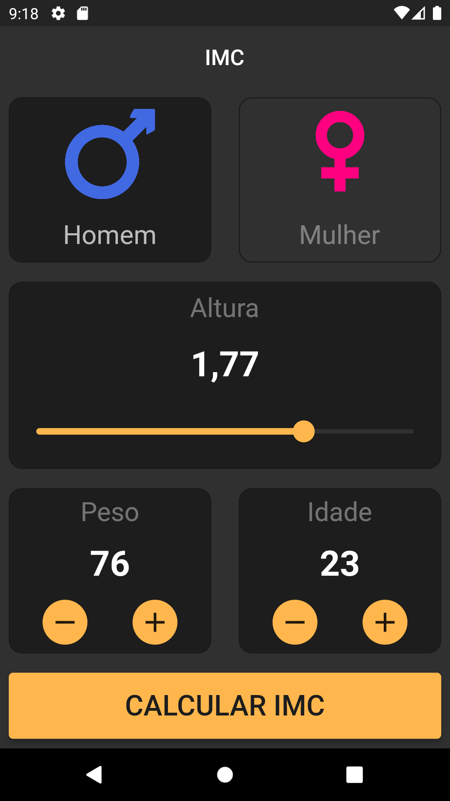
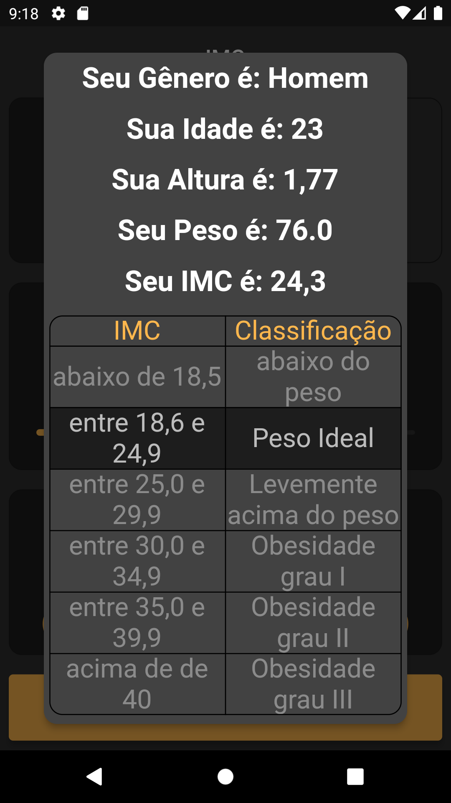

# imc_app

## App calculo IMC com Flutter e Provider.
## BMI calculation app with Flutter and Provider.

### Pode ser instalado pelo <a href ='https://github.com/robertoalvarezjunior/imc_app/blob/main/imc.apk'>APK</a> (apenas para android), ou clonando este repositório e emular o aplicativo.

### It can be installed via <a href ='https://github.com/robertoalvarezjunior/imc_app/blob/main/imc.apk'>APK</a> (only for android), or by cloning this repository and emulating the app.

    
    

